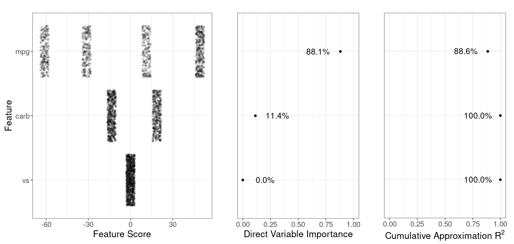

# modsculpt

<!-- start badges -->
[](https://genentech.github.io/modsculpt/unit-test-report/)
[](https://genentech.github.io/modsculpt/)
[](https://genentech.github.io/modsculpt/coverage-report/)
<!-- end badges -->


Additive modeling algorithms are an essential part of the machine learning modeler’s tool kit when working with tabular data. Such predictive models have excellent intrinsic interpretability and often have optimal or near optimal performance. In some cases, the best additive model performance is attained by models that are linear functions of the input features. Such linear additive models can be fit using classical statistical models, when there are not too many features relative to the size of the training dataset, or regularized methods such as elastic net, when there are many features. However, there are also many cases where additive functions need to flexibly allow for:

- Non linearity for improved performance,
- Imposing constraints on additive component functions for greater trustworthiness,
- Handling of many features,
- Identification of irrelevant or unnecessary features for model sparsity.

To address this need we have developed the Model Sculpting method for building additive models. This is a model building pipeline consisting of the following steps:

1. Build a strong learner for optimal performance. This can be a blackbox that delivers optimal performance. Often we use a tree ensemble such as XGBoost trained with Bayesian hyperparameter tuning.
1. Extract an additive model that best approximates the strong learner. We call this the rough model.
1. Use a direct variable importance measure to identify features that have negligible impact on the rough model. Effectively we identify rough model additive components that are nearly flat.
1. Obtain a final polished model by removing the unnecessary features from the rough model and potentially smoothing the additive components for the remaining features. Any univariate smoother can be used, including those with facilities to ensure constraints such as monotonicity.

This package provides code to implement the Model Sculpting pipeline.


## Installation

``` r
remotes::install_github(repo = "genentech/modsculpt")
```

For reproducibility, refer to a specific version tag (the latest is v0.1), for example

``` r
remotes::install_github(repo = "genentech/modsculpt", ref = "v0.1")
```


## Documentation

Please refer to https://genentech.github.io/modsculpt 
where you can see function reference as well as introduction vignette.


## Quick Introduction

Below we quickly show how to build a rough or a detailed model and visualize its components. 
For more detailed explanation, please see the vignette.

```
library(modsculpt)

# use mtcars dataset
df <- mtcars
df$vs <- as.factor(df$vs)
covariates <- c("mpg", "carb", "vs")

# train simple decision tree
model <- rpart::rpart(
  hp ~ mpg + carb + vs,
  data = df,
  control = rpart::rpart.control(minsplit = 10)
)
model_predict <- function(x) predict(model, newdata = x)

# create a rough model - extracted additive model from the decision tree
pm <- sample_marginals(df[covariates], n = 1e3, seed = 5)
rs <- sculpt_rough(
  dat = pm,
  model_predict_fun = model_predict,
  n_ice = 10,
  seed = 1,
  verbose = 0
)

# show variable importance
grid::grid.draw(g_var_imp(rs))
```


```
# create two detailed models - a smoothed version of a rough model
dsg <- sculpt_detailed_gam(rs) # gam smoothers per variable
dsl <- sculpt_detailed_lm(rs)  # lm smoothers per variable

# compare the components
comp <- g_comparison(
  sculptures = list(rs, dsg, dsl),
  descriptions = c("Rough", "Detailed - gam", "Detailed - lm")
)
comp$continuous
```


